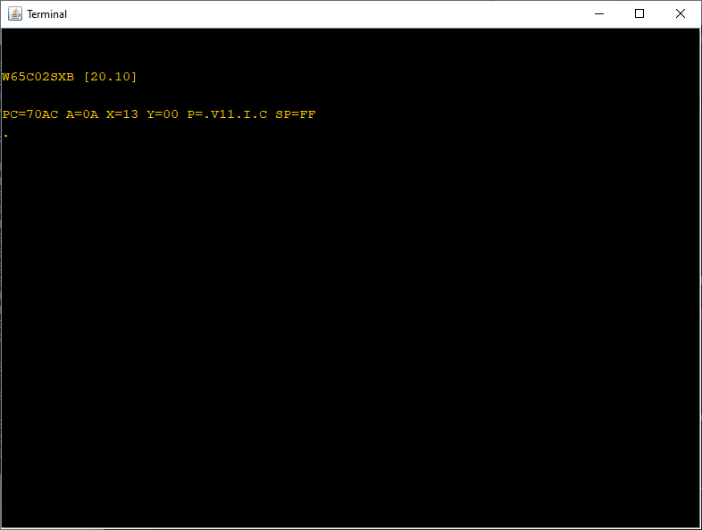

# A Simple Monitor for the WDC W65C02SXB SBC
This repository contains the code for a simple monitor for the WDC W65C02SXB development board that can be assembled, downloaded and run on Windows, Linux and MacOS.

## Requirements
The monitor is writen in structured 65C02 code uses my [Dev65 Java based development](https://github.com/andrew-jacobs/dev65) suite to build. You need to have a full version of Java 1.8 or later runtime installed (run 'java -version' in a command terminal to check what you have). The 'headless' version of java (installed by default in some Linux distributions) that does not contain the SWING GUI components needed by the uploader tool. 

# Building
Clone or download the repository to your machine then perform the following steps:

1. On a Windows machine run the batch file 'ports.bat' and find the name of the COM port connected to your SXB. Edit the batch file 'sxb.bat' and make sure that the port name after the '-port' option is the same.
```
D:\OpenSource\65xx\w65c02sxb-monitor>ports
COM6

D:\OpenSource\65xx\w65c02sxb-monitor>
```
On a Linux or MacOS machine run the equivalent shell script and edit the 'sxb.sh' script to make the port name match
```
andrew@virtual-ubuntu:~/Code/w65c02sxb-monitor$ sh -f ports.sh
ttyUSB0
andrew@virtual-ubuntu:~/Code/w65c02sxb-monitor$ 
```

2. Locate the monitor source folder (src/monitor) and open a terminal.
- In Windows type 'make' to run the batch file that assembles and links the code.
- In Linux/MacOs type 'sh -f make.sh' to run the shell script.

The assembler will complain about BRK being used as a label but the linker will produce a 'monitor.bin' file. The console transcript should look like this ...
```
D:\OpenSource\65xx\w65c02sxb-monitor\src\monitor>make

D:\OpenSource\65xx\w65c02sxb-monitor\src\monitor>java -cp ..\..\Dev65.jar uk.co.demon.obelisk.w65xx.As65 -include ..\..\include monitor.asm
Warning: monitor.asm (356) This label is a reserved word (BRK)

D:\OpenSource\65xx\w65c02sxb-monitor\src\monitor>if errorlevel 1 goto done

D:\OpenSource\65xx\w65c02sxb-monitor\src\monitor>java -cp ..\..\Dev65.jar uk.co.demon.obelisk.w65xx.Lk65 -code 7000-7eff -bss 0200-27ff -wdc -output monitor.bin monitor.obj

D:\OpenSource\65xx\w65c02sxb-monitor\src\monitor>if errorlevel 1 pause

D:\OpenSource\65xx\w65c02sxb-monitor\src\monitor>
```
or ...
```
andrew@virtual-ubuntu:~/Code/w65c02sxb-monitor/src/monitor$ sh -f make.sh
Warning: monitor.asm (356) This label is a reserved word (BRK)
andrew@virtual-ubuntu:~/Code/w65c02sxb-monitor/src/monitor$ 
```
3. Press the reset button on your SXB to make sure its boot firmware is running then:
- On Windows run the 'run.bat' file to download and start the monitor.
- On Linux/MacOS type 'sh -f run.sh' to start the process.

The command transcript for this should be similar to ...
```
D:\OpenSource\65xx\w65c02sxb-monitor\src\monitor>run

D:\OpenSource\65xx\w65c02sxb-monitor\src\monitor>call ..\..\sxb.bat loadbin monitor.bin exec 7000 term

D:\OpenSource\65xx\w65c02sxb-monitor\src\monitor>java -cp "..\..\Dev65.jar;..\..\jSerialComm-2.6.2.jar" uk.me.obelisk.sxb.Uploader -port COM6 loadbin monitor.bin exec 7000 term
Loaded 3840 ($f00) bytes
```
or ...
```
andrew@virtual-ubuntu:~/Code/w65c02sxb-monitor/src/monitor$ sh -f run.sh
Loaded 3840 ($f00) bytes

```
The uploader will display a terminal window on the screen which allows interaction with the monitor. It should display something like:



Typing a question mark followed by the enter key will display the commands that the monitor understands.

The monitor loads into RAM between $7000 upto $7DFF. It uses $F0-$FF on zero page for its private variables and $200-$27F for the command line buffer.

Zero page $00 thru $EF is free for user programs as is RAM from $280 thru $6FFF.